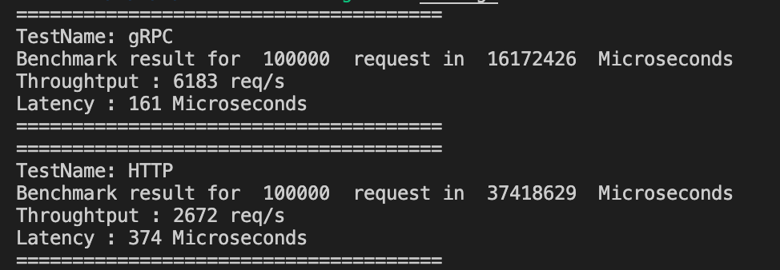

# Spring Grpc Http


This project is a simple example about How to build GRpc and Http API with Spring (without proxy).

More detail about this project at [here](https://medium.com/@thinhda/build-service-that-provides-http-and-grpc-api-with-spring-9e7cff7aa17a)

## Prerequisites

- Java 8
- Docker 18.09 or later
- Maven 3

## Getting Started

### Get started with Docker

```sh
# take a long time for first times to pull dependencies
DOCKER_BUILDKIT=1 docker build -t spring_grpc_http .
docker run --name spring_grpc_http --rm -d -p 6789:6789 -p 6790:6790 spring_grpc_http
```

### Get started with Java

```sh
# go to `core` folder, which contains pom.xml
cd core

# use maven to build
mvn clean package

# run binary by java command
java -jar target/app.jar
```

### Validate

Use Curl to validate HTTP API

```sh
curl --location --request POST 'http://localhost:6789/api/ping' \
--header 'Content-Type: application/json' \
--data-raw '{
  "timestamp": 20
}'

# Response:
# {
#   "timestamp": "20",
#   "message": "Pong"
# }
   
``` 

## Benchmark

Use simple [go client](benchmark/main.go)

```
go run main.go
```

Hardware Configurations:

- Macbook pro 2017 Intel Core i5 2.3GHz
- 16GB RAM

Results



- Throughput gRPC (*6183req/s*) **>2x** with Http (*2672req/s*)